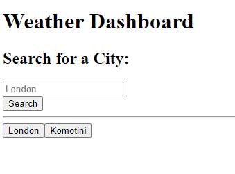

# Weather Dashboard - Github Repo weather-dashboard https://github.com/Evans20kom/weather-dashboard

## Description

# REPLACE ASAP

This is an application that utilizes third-party server APIs, html, css, bootstrap and Jquery to create an application that checks the weather in different locations according to a user's requests. The application saves the locations for future use.

Due to time constraints, the application is submitted while being and unfinished project in order to meet the deadline. Development to continue for future resubmission.

## Table of Contents (Optional)

You can find the deployed application [here](https://evans20kom.github.io/weather-dashboard/): https://evans20kom.github.io/weather-dashboard/

You can find the github repo [here](https://github.com/Evans20kom/weather-dashboard): https://github.com/Evans20kom/weather-dashboard

## Installation

N/A

## Usage

When you open the deployed application [here](https://evans20kom.github.io/weather-dashboard/), a page will appear with two starter cities and a search function to include more cities.
    

## Credits

A number of sources were used for the development of this application:

<ul>
<li>Chris H - Central Grader: On the challenge for week 3, they alerted me to the fact that the presentation of my README file is not the expected one; upon investigating, I realized that markdown syntax was not correct</li>
<li>CG Collin - Central Grader: After grading the challenge for week 4, they confirmed that the corrections I made to the README file were acceptable; based on this feedback, I maintained the previous REAME file structure as a template for future projects.</li>
<li>© 2024 edX Boot Camps LLC.: Code for generating buttons dynamically was modelled after approach used in the bootcamp on following lesson: UK-VIRT-FE-PT-11-2023-U-LOLC-1\08-server-apis-module\02-api-practice-lesson\activities\05-Stu-WorkingMovieApp</li>

## License

MIT License

## Badges

N/A

## Features

N/A

## How to Contribute

N/A

## Tests

